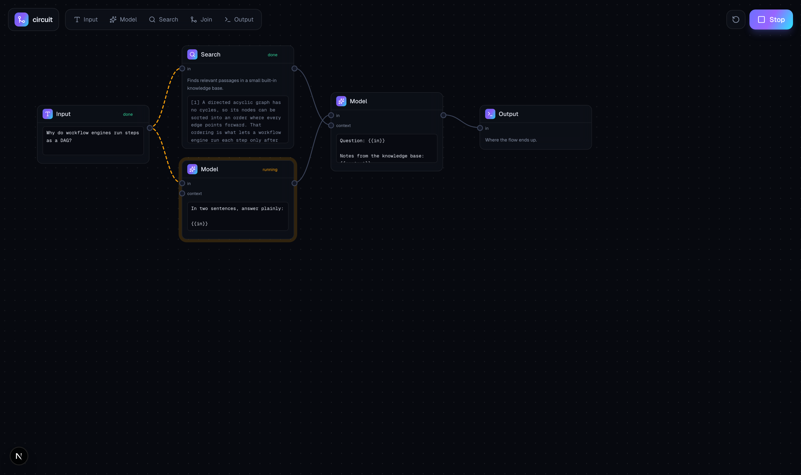
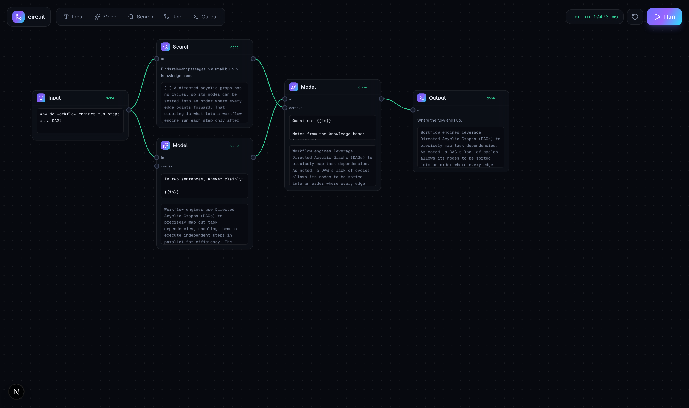

# Circuit

**A visual AI flow builder.** Drag blocks onto a canvas, wire them together, hit
Run, and watch data move through the graph: nodes light up as they execute, text
streams into them, and the wires carrying data pulse. The node editor and the
execution engine are both built from scratch.

[](https://github.com/SaadAsif-NU/circuit/actions/workflows/ci.yml)


[](LICENSE)



## What it actually is

Two hard parts, both written by hand:

**1. A DAG execution engine** (`src/lib/engine.ts`, no DOM, no framework, unit
tested). A flow is a directed acyclic graph, so running one means:

- **validate** it: unknown node kinds, dangling edges, an edge into a port that
  does not exist, two wires feeding one port, and cycles (found with a
  depth-first search for a back edge).
- **order** it: Kahn's algorithm, kept in _waves_. Every node in a wave depends
  only on earlier waves, so a wave runs in parallel.
- **walk** it: gather each node's inputs from its incoming edges, run it, and
  emit an event for everything that happens. A node that throws does not take
  the run down; its dependants are skipped and independent branches still finish.

**2. A node editor**, with no react-flow or xyflow. HTML nodes (so they can hold
live text fields and streamed output) over an SVG wire layer, both under one
pan/zoom transform. Ports are anchored to fixed offsets rather than measured, so
a wire stays put while a node grows with streaming text. Drag a node by its
header, drag from an output port to an input port to connect, click a wire to cut
it, scroll to zoom about the cursor.

## Execution streams from the server

The browser posts the graph to `/api/run`. The engine runs **on the server**, so
the API key never reaches the client, and every event it emits is forwarded down
a `text/event-stream` as it happens:

```
run.started -> node.started -> node.token xN -> edge.active -> node.completed -> run.completed
```

The canvas just folds those events into render state, which is why a run animates
live instead of appearing all at once. (`EventSource` cannot POST, so the client
reads the response body and parses the SSE frames itself.)



## The blocks

| Block      | Inputs          | What it does                                                                        |
| :--------- | :-------------- | :---------------------------------------------------------------------------------- |
| **Input**  | —               | The text the flow starts from.                                                      |
| **Model**  | `in`, `context` | Prompts Gemini and streams the reply. `{{in}}` drops in what arrived.               |
| **Search** | `in`            | Retrieves passages from a small built-in knowledge base, so a flow can be grounded. |
| **Join**   | `a`, `b`        | Merges two branches with a template.                                                |
| **Output** | `in`            | Where the flow ends up.                                                             |

Blocks are data, not branching: a node declares its ports and a runner, and the
validator, the canvas, and the engine all pick it up.

The flow the canvas opens with is a **diamond** on purpose: one input fans out to
a search and a model that run at the same time, then fans back into a second
model that uses both. You can watch both middle nodes light up together.

## Run it

You need [Node.js](https://nodejs.org) 20 or newer.

```bash
git clone https://github.com/SaadAsif-NU/circuit.git
cd circuit
npm install
npm run dev
```

Open [http://localhost:3000](http://localhost:3000) and press **Run**.

- Drag a node by its **header**, drag from a node's **right port** to another
  node's **left port** to wire them, **click a wire** to cut it.
- **Scroll** to zoom, drag the background to pan.
- Add blocks from the palette; delete one with the **x** on its header.

### Optional: use a real model

Circuit runs **without an API key**: Model nodes return a deterministic simulated
reply, streamed word by word, so the wiring and the animation are all real. To
run them on a real model:

```bash
cp .env.example .env.local
```

Paste a free key from [Google AI Studio](https://aistudio.google.com/apikey) into
`.env.local` and restart:

```
GEMINI_API_KEY=your_key_here
```

> `.env.local` is gitignored, and the key is only ever read on the server.

## Architecture

```
src/
  lib/
    graph.ts      # Flow, FlowNode, FlowEdge, Zod schema
    nodes.ts      # the NodeDefinition contract + templating
    registry.ts   # the blocks: input, llm, search, join, output
    engine.ts     # validate -> topoLevels -> execute, emitting events
    llm.ts        # streamed Gemini, with an offline stand-in
    search.ts     # the built-in knowledge base
    layout.ts     # port geometry, bezier wires, the pan/zoom transform
    useRun.ts     # posts the flow, folds the SSE stream into render state
    presets.ts    # the starter flow
  app/
    api/run/route.ts   # POST a flow -> SSE of engine events
    page.tsx
  components/
    Canvas.tsx    # pan, zoom, drag, connect
    NodeCard.tsx  # one block: ports, fields, streamed output
    Wire.tsx      # a bezier connection, marching when live
    Toolbar.tsx   # palette, run/stop, validation
```

## Scripts

```bash
npm run dev          # the canvas on :3000
npm run build        # production build
npm test             # engine + geometry unit tests (Vitest)
npm run typecheck    # tsc --noEmit
npm run lint         # eslint
```

## Tests

The engine and the canvas maths are the parts that must be right, so they are
tested directly: validation (every rejection above), cycle detection, that a
topological wave never precedes its dependency, that values thread along edges
and fan in, that a failure skips its dependants while independent branches still
run, plus port geometry, bezier clamping, and that zooming keeps the point under
the cursor fixed.

```bash
npm test
```

## License

MIT
